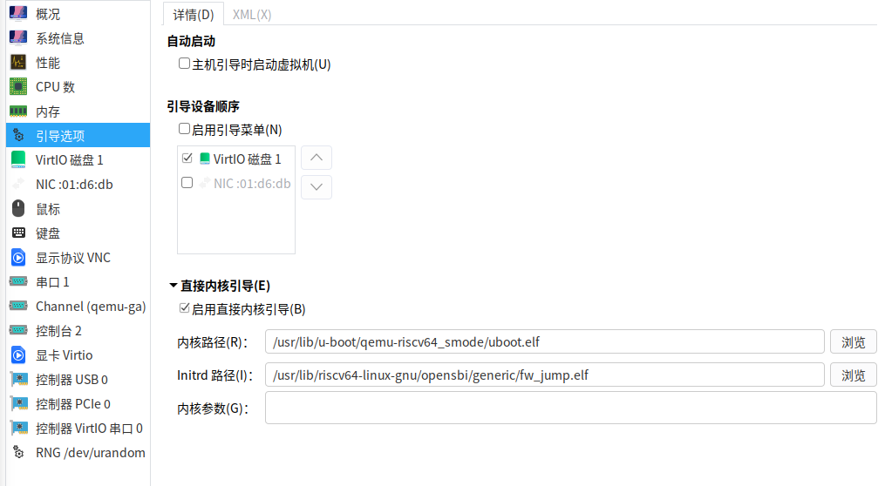

# 介绍

在 qemu 中运行 riscv 架构的系统。

## 准备 rootfs

执行脚本制作根文件系统

```bash
./build-img.sh
```

# qemu 中启动

```bash
sudo qemu-system-riscv64 -nographic -machine virt -m 8G \
    -bios /usr/lib/riscv64-linux-gnu/opensbi/generic/fw_jump.elf \
    -kernel /usr/lib/u-boot/qemu-riscv64_smode/uboot.elf \
    -object rng-random,filename=/dev/urandom,id=rng0 -device virtio-rng-device,rng=rng0 \
    -append "console=ttyS0 rw root=/dev/vda1" \
    -device virtio-blk-device,drive=hd0 -drive file=deepin-qemu-riscv64.qcow2,format=qcow2,id=hd0 \
    -device virtio-net-device,netdev=usernet -netdev user,id=usernet,hostfwd=tcp::22222-:22
```

在 virt-manager 配置内核启动



# 参考

[在 libvirt 中运行 RISC-V 虚拟机](https://jia.je/software/2022/05/31/qemu-rv64-in-libvirt/)
